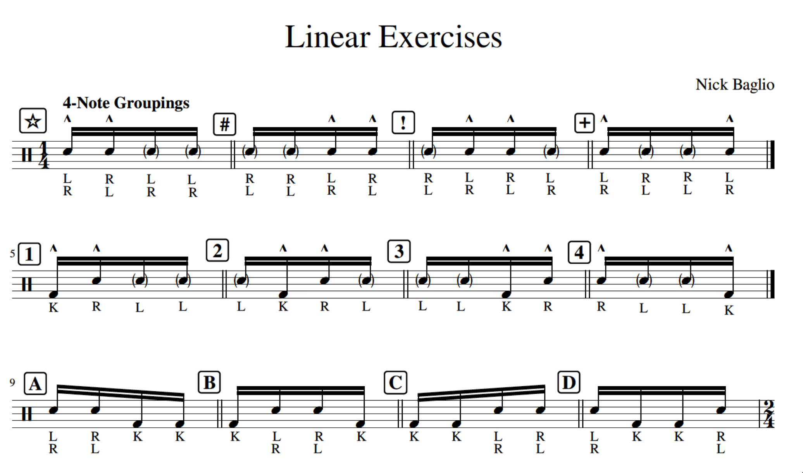

# Drumming Practice

1. [For Next Week](#for-next-week)
2. [Linear Drumming](#linear-drumming)
3. [Jams and Beats](#jams-and-beats)
4. [Aeumbra Transcriptions](#aeumbra-transcriptions)
5. [Transcriptions and Songs](#transcriptions-and-songs)

## For Next Week

[66*](https://gscribe.com/share/TgESegm7Nw7TRwYX6)
[66#](https://gscribe.com/share/PJDfAhLdJhCeBmyz8)
[66!](https://gscribe.com/share/H68ujcxtZbqfDve98)
[66+](https://gscribe.com/share/p7ffgu3bkRSX8jz89)
[661](https://gscribe.com/share/gC7soaoBZszJCyv88)
[662](https://gscribe.com/share/izik1fMbGgM8RaSF8)
[663](https://gscribe.com/share/Mqu59fSqmmZxDxKG6)
[664](https://gscribe.com/share/kvGHAtokid6VQAXN8)
[66A](https://gscribe.com/share/LEUbLWL5xvDBcrJy6)
[66B](https://gscribe.com/share/ethmHv88ZismyQjQ7)
[66C](https://gscribe.com/share/44DFUwzDSFBa7hAx6)
[66D](https://gscribe.com/share/pksq7AGxfwRWevgM8)

## Linear Drumming

[Blank](https://gscribe.com/share/75Z7pycFxgujSmwcA)

### Arhive

[1!](https://gscribe.com/share/hcZJr4puxbD3gcRF8)

[APLUS](https://gscribe.com/share/jryDw61BvWS62M1p8)

[!2!2](https://gscribe.com/share/PNMMctnCGHfUStVx9)

[DD++](https://gscribe.com/share/yueW9zkimudvucmF9)

[##44](https://gscribe.com/share/RgriWSv93aiUtBC66)

[2D2D]( https://gscribe.com/share/y9qBg1YKcFpgibXWA)

[CC33](https://gscribe.com/share/iZiuGZnxrwczbme86)

[****CCCC](https://gscribe.com/share/RLae7H5eCeSqqp2U8)

[STAR-C-STAR-C](https://gscribe.com/share/yyK4jnhJFLaRCBwT8)

[2D2D](https://gscribe.com/share/svFhgaR5ujr1VHmA6)

[**CC](https://gscribe.com/share/RLae7H5eCeSqqp2U8)

[BBBB3333](https://gscribe.com/share/Dyr8iHxb9nHbpBoN8)

[BBBB1111](https://gscribe.com/share/wd3b6mDTSm4CN2Vx5)

[1111CCCC](https://gscribe.com/share/iG5LuN86HAUm1chn8)

[3333!!!!](https://gscribe.com/share/ECp5SYowyZDmxDqC7)

[!!!!4444](https://gscribe.com/share/paPURAiaNmXMz4hQA)

[CC33](https://gscribe.com/share/iZiuGZnxrwczbme86)

[2D2D](https://gscribe.com/share/svFhgaR5ujr1VHmA6)

[22DD](https://gscribe.com/share/meuukLUAF5mdsnSB6)

## Jams and Beats

[15 Slow](https://github.com/gennarocc/drumming-practice/assets/13220093/56c961d4-d3ca-494d-8617-4ab5eaba974f)

[Groove 43](https://gscribe.com/share/JJ8BTn6bobkYGgaC6)

[Groov 43 - Alt](https://gscribe.com/share/Yjo518rLA4uajmqg9)

[43 Slow](audio/43-slow.mov)

[KRL as 16ths](https://gscribe.com/share/GFibwuXFXeKGVuoS8)

[43 Fast V2](https://gscribe.com/share/PNMMctnCGHfUStVx9)

## Aeumbra Transcriptions

[Song 1 - Beat 1](https://gscribe.com/share/4Bw7e2W48mPmcaHW9)

[Song 1 - Beat 2](https://gscribe.com/share/h6M1JjsDvSyQn8zj7)

[Song 2 - Beat 2](https://gscribe.com/share/sespSnjFTU8aq3jx6)

[Song 3 - Beat 3](https://gscribe.com/share/Rwvfd91C4MJDPUW48)

[Song 2 - Beat 3](https://gscribe.com/share/UAENRBxsLKRUj6t68)

